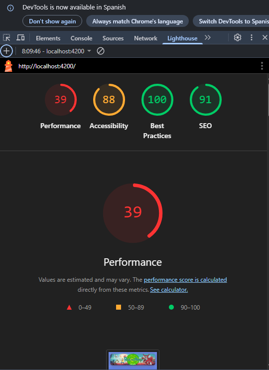
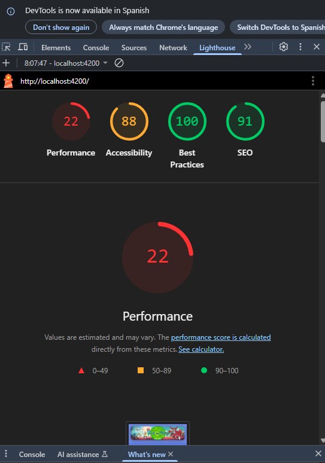
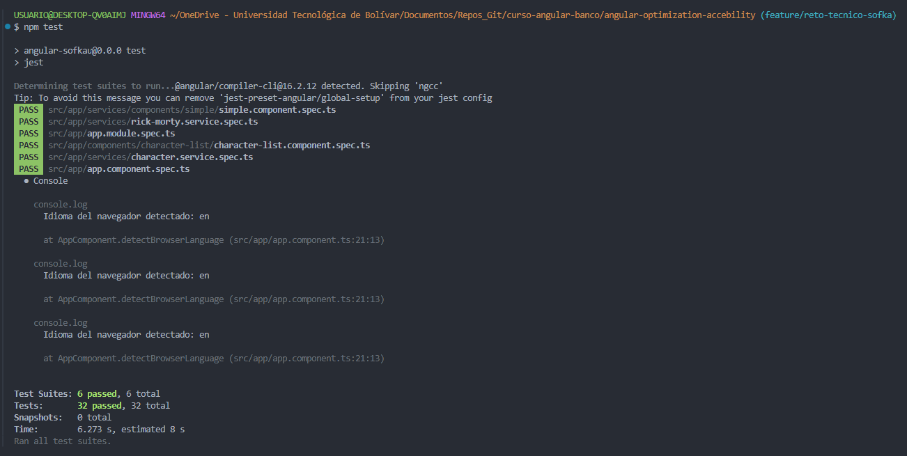

# AngularSofkau

This project was generated with [Angular CLI](https://github.com/angular/angular-cli) version 16.2.16.

## Development server

Run `ng serve` for a dev server. Navigate to `http://localhost:4200/`. The application will automatically reload if you change any of the source files.

## Code scaffolding

Run `ng generate component component-name` to generate a new component. You can also use `ng generate directive|pipe|service|class|guard|interface|enum|module`.

## Build

Run `ng build` to build the project. The build artifacts will be stored in the `dist/` directory.

## Running unit tests

Run `npm test` to execute the unit tests via **Jest**.

---

# Testing Documentation and Evidence

## Overview

This project includes **unit tests and lightweight integration tests** using Jest for faster test execution and easier maintenance compared to Karma.

The tests cover:

1. **HTTP service** — mocking both success and error responses.
2. **Component interaction** — verifying user interactions and DOM changes.
3. **Lightweight integration** — testing the interaction between component and service with mocked HTTP calls.

## Captures





## Technical decisions

- Migrated from Karma to Jest using `jest-preset-angular` for faster testing.
- Added global patches for `TextEncoder` and `TextDecoder` to fix environment issues in Jest (`jest.setup.ts`).
- Configured Jest properly to support Angular features including i18n.
- Mock HTTP requests with Angular's `HttpTestingController` to simulate API responses.
- Used Angular testing utilities (`TestBed`, `fixture.detectChanges()`) for realistic component tests.

## Running tests

To run all tests, execute:

```bash
npm test
