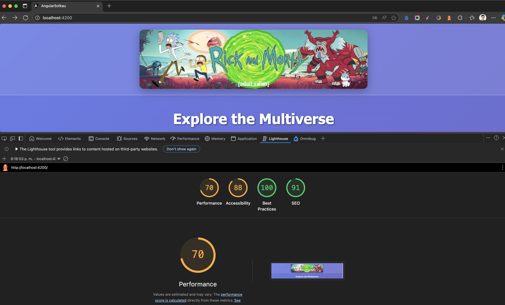
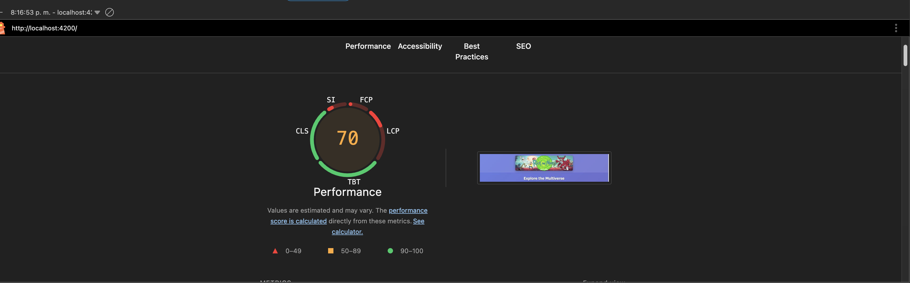
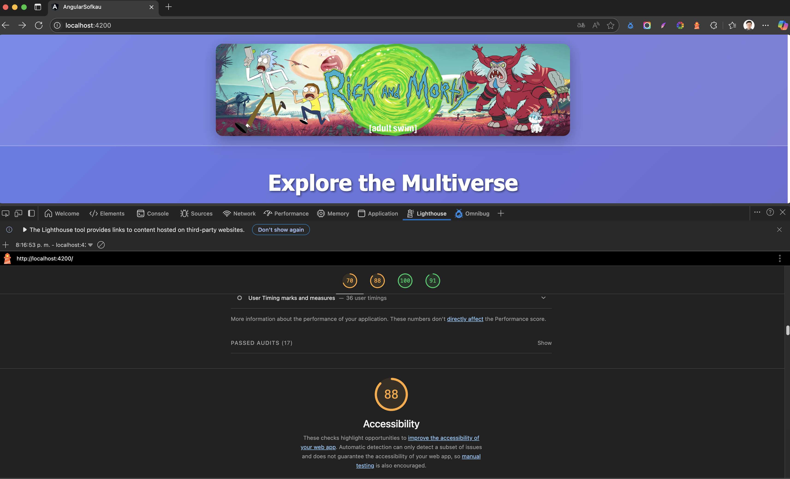
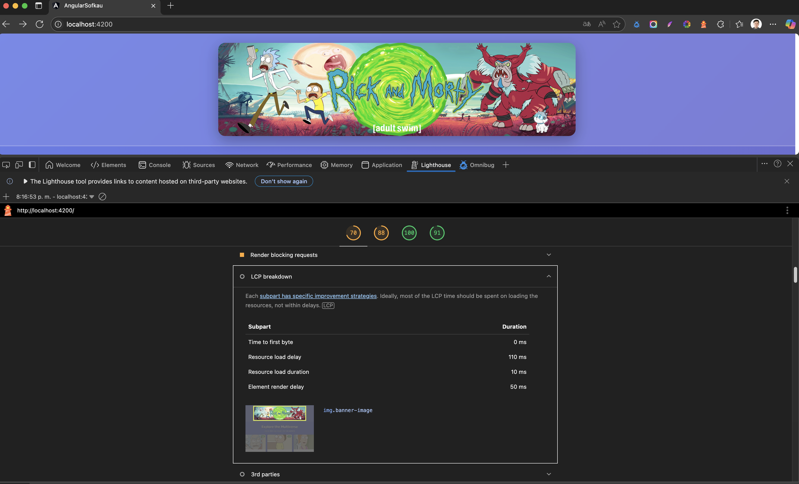
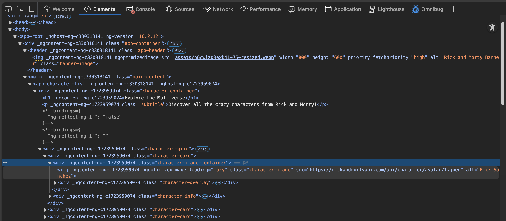
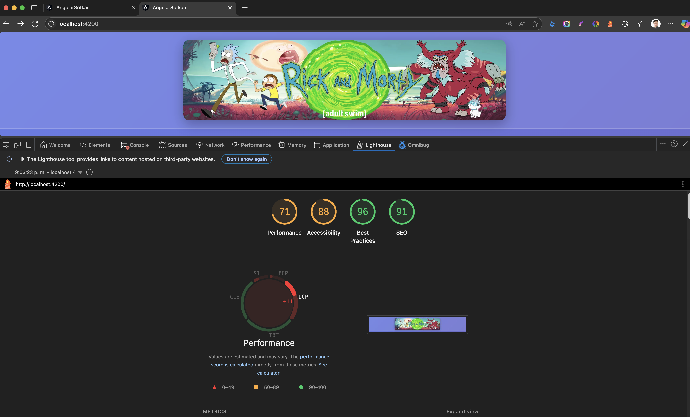
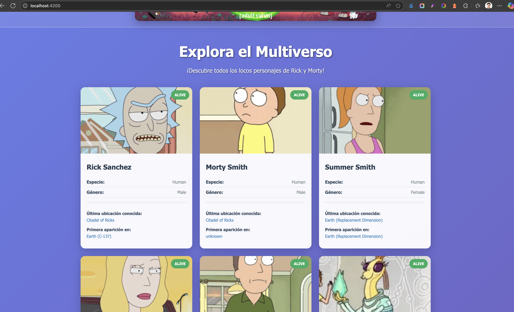
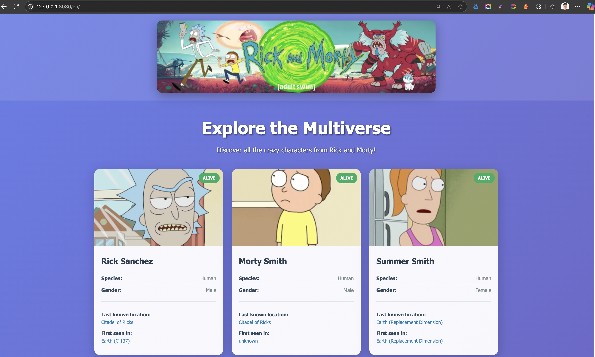
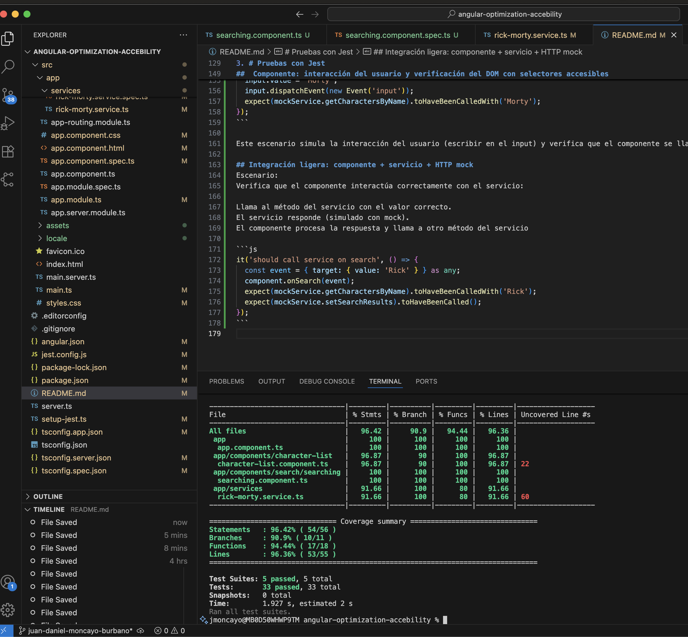

# AngularSofkau

This project was generated with [Angular CLI](https://github.com/angular/angular-cli) version 16.2.16.

## Development server

Run `ng serve` for a dev server. Navigate to `http://localhost:4200/`. The application will automatically reload if you change any of the source files.

## Code scaffolding

Run `ng generate component component-name` to generate a new component. You can also use `ng generate directive|pipe|service|class|guard|interface|enum|module`.

## Build

Run `ng build` to build the project. The build artifacts will be stored in the `dist/` directory.

## Running unit tests

Run `ng test` to execute the unit tests via [Karma](https://karma-runner.github.io).

## Running end-to-end tests

Run `ng e2e` to execute the end-to-end tests via a platform of your choice. To use this command, you need to first add a package that implements end-to-end testing capabilities.

## Further help

To get more help on the Angular CLI use `ng help` or go check out the [Angular CLI Overview and Command Reference](https://angular.io/cli) page.

# Documentacion curso optimizacion accesibilidad y pruebas en angular
## Estado inicial de proyecto


### Performance


### Accesibilidad


1. # Optimización con NgOptimizedImage

## Imagen que mas impacta en la carga inicial (LCP)


teniendo en cuenta que en el uso de header y que la imagen que afecta la carga inicial en mayor medida corresponde a el fragmento:

```html
<header class="app-header">
  
</header>
```

correccion:

```html
    
```

ademas se modifica el formato de la imagen asociada de png a webp para mejorar la carga y se uso herramientas para redimenzionar la imagen inicial al tamaño objetivo que son 800*600 en desktop para optimizar la carga al igual que se redujo a 75% la calidad pera mejorar el performance


## Uso de Lazi Loading para imagenes no principales



***Reporte despues de los cambios***



2. # Usabilidad y Accesibilidad con i18n (Angular Localize)

## Instalacion y configuracion de Angular Localize

  A. Instalar Angular Localize ***ng add @angular/localize***

  B. Configurar los idiomas en angular.json

  ```json
  "i18n": {
    "sourceLocale": "es",
    "locales": {
      "en": "src/locale/messages.en.xlf",
      "fr": "src/locale/messages.fr.xlf"
    }
  }
  ```

  C. agregar etiqueta en elemnto para ser objeto de traducción usando i18n por ejemplo:
  ```html
  <h1 i18n="@@characterListTitle">Explora el Multiverso</h1>
  ```
  al **´@@´** en esta etiquete permite asignar un id particular para hacer mas facil el manejo de las trducciones desde el archivo .xlf    

  D. Extrae los mensajes para traducción, ejecutando el siguiente comando: ***ng extract-i18n --output-path src/locale*** esto con el objetivo de crear el archivo messages.xlf

  E. Traduccion de los archivos, es decir a partir del archivo creado en el paso anterior messages.xlf crear una copia y agregando el idioma al que se va a traducir por ejemplo messages.en.xlf (inglés)

  F. configurar la aplicación para cada idioma, en el archivo angular.json, agrega una configuración de build para cada idioma en la sección projects > [tu-app] > architect > build > configurations. Ejemplo:
  ```json
  "en": {
    "localize": ["en"]
  },
  "fr": {
    "localize": ["fr"]
  }
  ```

  G. Importante usar ***ng build --localize*** para que se genere la carpeta **en** en dist, y posterior a esto ejecutar ***npx http-server ./dist/angular-sofkau/browser/en*** para usar un servidor estático para servir la carpeta del idioma deseado

  ademas usar ***ng build --localize --base-href /en/** para garantizar acceso a los recursos raiz, es decir que los archivos tengan rutas relativas

## i18n Español

confirguracion en español por defecto
## i18n Ingles
para hacer esto se necesita usar ***ng build --configuration=en***




3. # Pruebas con Jest

para este ejercicio se agrego un nuevo compnente para busqueda de personajes por el nombre que se llama searching componente y el cual usa un nuevo metod del servicio llamada getCaharacterByName

## Servicio con HTTP: caso de éxito (y opcional error) verificando método/URL y respuesta simulada
para esta prueba se hace uso del metodo getCharactersByName porpio del servicio y la api de rick and morty

```js
it('should fetch characters by name', () => {
  // Simula llamada HTTP y verifica respuesta
  service.getCharactersByName('Rick').subscribe(response => {
    expect(response.results.length).toBeGreaterThan(0);
    expect(response.results[0].name).toBe('Rick Sanchez');
  });
  const req = httpMock.expectOne('https://rickandmortyapi.com/api/character/?name=Rick');
  expect(req.request.method).toBe('GET');
  req.flush({ info: { count: 1, pages: 1, next: null, prev: null }, results: [mockCharacter] });
});
```

##  Componente: interacción del usuario y verificación del DOM con selectores accesibles
En el archivo de pruebas del componente de searching(searching.component.spec.ts) se tene el escenario

```js
it('should bind input event to onSearch', () => {
  const input = fixture.nativeElement.querySelector('.search-input');
  input.value = 'Morty';
  input.dispatchEvent(new Event('input'));
  expect(mockService.getCharactersByName).toHaveBeenCalledWith('Morty');
});
```

Este escenario simula la interacción del usuario (escribir en el input) y verifica que el componente se llama correctamente y que el DOM responde como se espera

## Integración ligera: componente + servicio + HTTP mock
Escenario:
Verifica que el componente interactúa correctamente con el servicio:

Llama al método del servicio con el valor correcto.
El servicio responde (simulado con mock).
El componente procesa la respuesta y llama a otro método del servicio

```js
it('should call service on search', () => {
  const event = { target: { value: 'Rick' } } as any;
  component.onSearch(event);
  expect(mockService.getCharactersByName).toHaveBeenCalledWith('Rick');
  expect(mockService.setSearchResults).toHaveBeenCalled();
});
```
## evidencia de resultado de pruebas ejecutadas y cobertura

